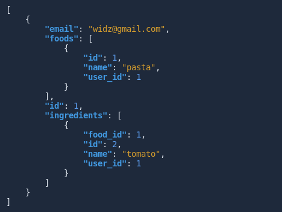
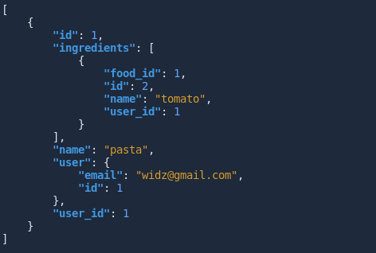
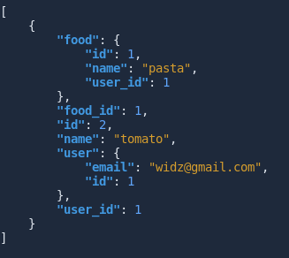

# Calories Tracker API

> This is an API for a tracking app

   
   
   
   

## End Points

### (domain-name)/api/v1/users

### (domain-name)/api/v1/users/:id/foods

### (domain-name)/api/v1/users/:id/foods/:id/ingredients

> keep in mind that I am just showing the
endpoints I used myself. Make sure you
run `rails routes` in your terminal to see more routes.

## Prerequisites

- Ruby 3.0.0
- Ruby On Rails
- Code Editor(VScode)

## Usage

1. Clone the repository by using the `git clone git@github.com:widzthedvloper/newapi.git` command in your terminal
2. `cd` into the cloned repository
3. Run `bundle install`
4. Run `rails s` to run the app on a local server
5. Open the folder in the code editor of your choice :)
6. run `bundle exec rspec` to run the tests

## Contributing

This project is for educational purposes.

## Acknowledgment

- Austin Kabiru (@akabiru_)
- Microverse

👤 **Widzmarc Jean Nesly Phelle**

- GitHub: [@widzthedvloper](https://github.com/widzthedvloper)
- Twitter - [@widzthedvloper](https://twitter.com/widzthedvloper)
- LinkedIn: [@widzthedvloper](https://www.linkedin.com/in/widzmarc-jean-nesly-phelle-252a26129/)

### Show your support

Give a ⭐️ if you like this project!

## License

MIT License
